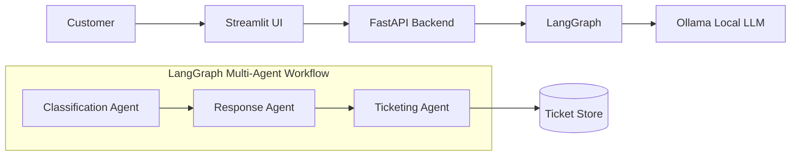
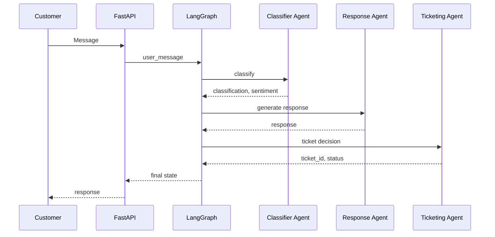
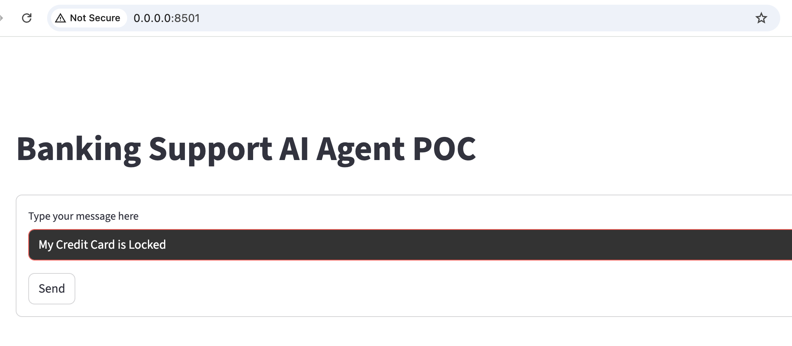
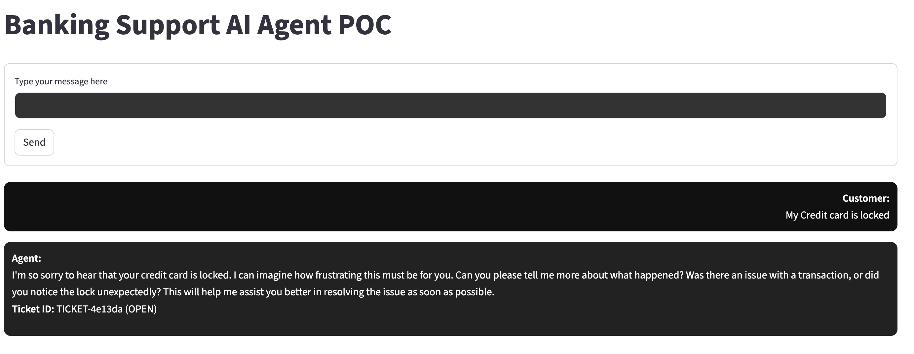

## Banking Support Multi-Agent AI App
** A POC Banking Support Multi-agent GenAI system tailored for banking customer support workflows **  

The objective is to design and implement a multi-agent AI assistant that handles:

This model aims to:

* Classify incoming user messages as queries/feedback and determine the associated sentiment  (positive or negative)
* Personalized responses based on classification and user sentiment
* Ticket tracking and updates through integration with a support database


Key Components :
1. Ollama LLM Server: Local LLM inference engine for AI processing
2. LangGraph Agents: Modular AI agents for classification, response generation, and workflow orchestration
3. FastAPI Backend: Handles requests, orchestrates agents, and interacts with LLM.
4. Streamlit UI: User-friendly chat interface for customers and agents.

##  Architecture Diagram




## Sequence Diagram



## TECH STACK
Python 3.11

FastAPI · LangGraph · LangChain · Ollama · Streamlit · Docker · Pytest


## Setup & Installation

```
Clone the repository:
git clone https://github.com/Sbajman/banking-support-ai.git
cd banking-support-ai
```

Runnning the app locally
1. ollama serve (Start Ollama Server)
2. Ollama pull llama3.2:3b
3. export OLLAMA_BASE_URL=http://localhost:11434
Also make sure the streamlit request us sent to http://localhost:8000/support)
4. uvicorn main:app --host 0.0.0.0 --port 8000
5. streamlit run app.py


# Use Docker to run the app
Build and start services using Docker Compose:
```docker compose up --build```


This will start:

FastAPI backend at http://localhost:8000
Streamlit UI at http://localhost:8501
Ollama LLM server at port 11434

## Usage

Open Streamlit UI in your browser:

http://localhost:8501


Type a banking support query in the customer chatbox.
The AI agent classifies the message and generates a response.
Responses from Agents appear in the chat window 
under Agent: you have the user query and
Customer messages appear under Customer:






## Testing
Unit tests for agents are included:

```
pytest tests/ -vvvv
```

The Tests included:
1. Classify state propagation: Assert on the sentiment of user message
2. Test Response generation
3. Test ticket generation for negative feedback. No ticket should be generated for positive feedback.

Future Improvement:
1. AI & Agent Intelligence: Add confidence scores for intent and sentiment, 
Introduce short term/Long term memory to store multi-turn conversations,
Enable agents to call external tools(Account status, Card API, FAQ's..etc)
combine lightweight rules with LLM classification for faster more deterministic behavior.
2. System Architecture: Add support for Async and streaming responses.
3. Testing and Quality: Enhance the test coverage.
4. Enhance Observability & Monitoring, Security Compliance, MLOps CI/CD deployment.
5. Enhance Product and UX.
6. Fine tune Banking specific LLM for higher accuracy and consistency.